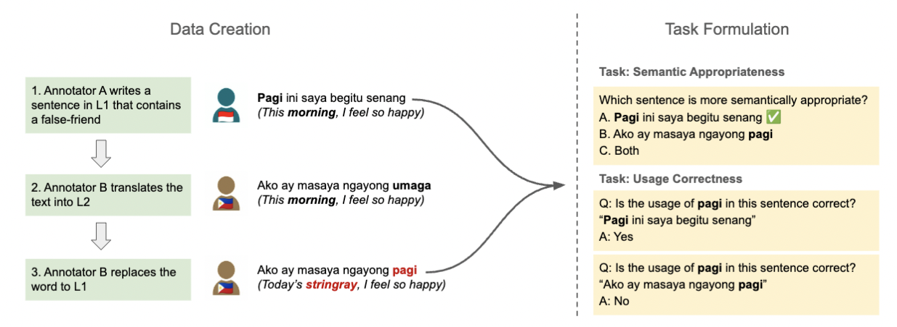

# StingrayBench

StingrayBench is a benchmark dataset designed to evaluate cross-lingual sense disambiguation in multilingual large language models (LLMs). This dataset targets the comprehension of *false friends*—words that appear orthographically similar but have distinct meanings across languages. It serves as the first benchmark specifically measuring cross-lingual semantic understanding in LLMs.

## Overview

Recent advancements in multilingual LLMs have expanded their applicability across languages. However, these models frequently exhibit a preference for higher-resource languages, sometimes misrepresenting or misunderstanding user intent in lower-resource languages. StingrayBench addresses this bias by focusing on *false friends* and *true cognates*, creating a reliable and reproducible benchmark for cross-lingual sense disambiguation.

- **Dataset URL:** [StingrayBench on Hugging Face](https://huggingface.co/datasets/StingrayBench/StingrayBench)
- **Evaluation Suite:** [StingrayBench GitHub](https://github.com/SamuelCahyawijaya/stingraybench)

## Key Features

1. **Language Pairs:** StingrayBench covers four language pairs that include high-resource and low-resource languages:
   - English-German (\textsc{en-de})
   - Chinese-Japanese (\textsc{zh-ja})
   - Indonesian-Malay (\textsc{id-ms})
   - Indonesian-Tagalog (\textsc{id-tl})

2. **Task Types:** The dataset is designed to evaluate semantic appropriateness and usage correction across these language pairs.
   - **Semantic Appropriateness:** Models identify which sentence is semantically accurate given two options.
   - **Usage Correction:** Models identify incorrect uses of cognate words in context, focusing on words with distinct meanings between the languages.

3. **New Metrics:** 
   - *Cognate Bias* quantifies the tendency of a model to select words based on language preference rather than semantic appropriateness.
   - *Cognate Comprehension Score* measures the accuracy of LLMs in distinguishing false friends and true cognates across language pairs.

<p align="center">
   
</p>

## Dataset Description

### Data Construction

StingrayBench is built in collaboration with native speakers of each language pair. Annotators provided translations, labeled false friends and true cognates, and created sentence examples to illustrate correct and incorrect usage.

<p align="center">
   
</p>

### Dataset Statistics

StingrayBench includes 705 data entries with 259 true cognate entries and 446 false friend entries distributed as follows:

- **English-German:** 196 entries (98 true cognates, 98 false friends)
- **Chinese-Japanese:** 165 entries (51 true cognates, 114 false friends)
- **Indonesian-Malay:** 186 entries (52 true cognates, 134 false friends)
- **Indonesian-Tagalog:** 158 entries (58 true cognates, 100 false friends)

### Example Prompts and Responses

#### Semantic Appropriateness Task

```plaintext
Prompt:
Which sentence is more semantically appropriate?
A. "Ich habe einen Arm." (German)
B. "I have an Arm." (English)
C. "Both sentences are appropriate."

Target Completion: "C. Both sentences are appropriate."
```

#### Usage Correction Task

```plaintext
Prompt:
Is the usage of "pagi" in this sentence correct? "Ako ay masaya ngayong pagi." (Tagalog)

Target Completion:
"No, the usage of 'pagi' is incorrect. 'Pagi' means 'stingray' in Tagalog, and the sentence should use 'umaga' for 'morning'."
```

## How to Use
```python
# Load Dataset 
config_name = 'en_de' # supported config names: ['id_tl', 'id_tl_common', 'zh_ja', 'zh_ja_common', 'id_ms', 'id_ms_common', 'en_de', 'en_de_common']
dataset = datasets.load_dataset("StingrayBench/StingrayBench", config_name, split=datasets.Split.TEST)

# Load Prompt
from prompts import CONFIG_TO_PROMPT
task_name = 'semantic_correctness' # supported task names: ["semantic_correctness", "usage_correctness_l1", "usage_correctness_l2"]
prompt_template = CONFIG_TO_PROMPT[task]
```

For more detail, please check our [likelihood](https://github.com/SamuelCahyawijaya/stingraybench/blob/main/src/likelihood_eval.py) and [generation](https://github.com/SamuelCahyawijaya/stingraybench/blob/main/src/generation_baseline_api.py) evaluation scripts.

## Licensing

The StingrayBench is available under the [Creative Commons Attribution-ShareAlike 4.0 International (CC-BY-SA 4.0) license](https://creativecommons.org/licenses/by-sa/4.0/), while all the code releases is licensed under the [Apache-2.0 license](https://github.com/SamuelCahyawijaya/stingraybench/blob/main/LICENSE). This ensures open access, encouraging collaboration and promoting fairer language modeling practices for the multilingual community.

## Citation Information
```
@article{cahyawijaya2024thank,
  title={Thank You, Stingray: Multilingual Large Language Models Can Not (Yet) Disambiguate Cross-Lingual Word Sense},
  author={Cahyawijaya, Samuel and Zhang, Ruochen and Lovenia, Holy and Cruz, Jan Christian Blaise and Gilbert, Elisa and Nomoto, Hiroki and Aji, Alham Fikri},
  journal={arXiv preprint arXiv:2410.21573},
  year={2024}
}
```
